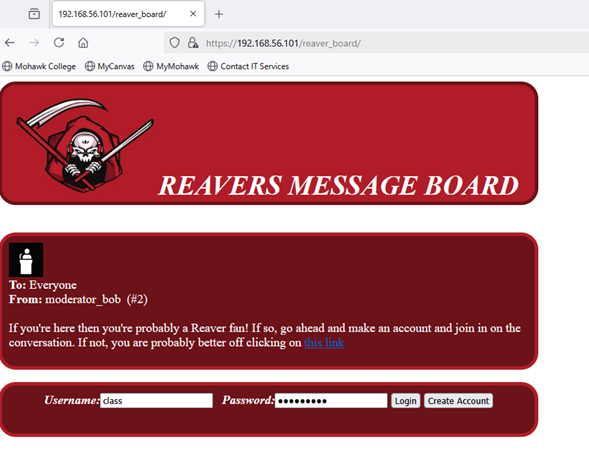
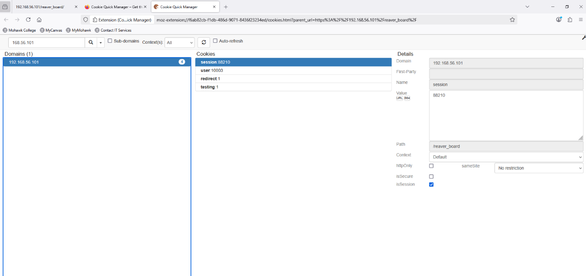
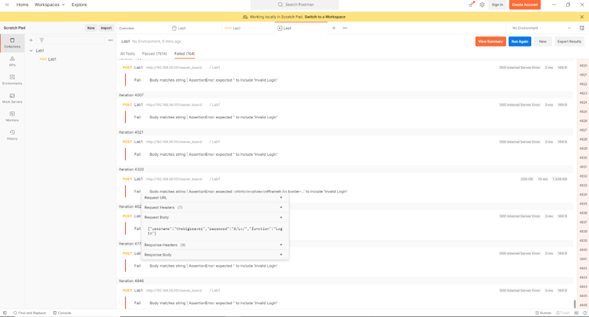
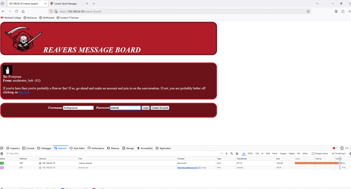
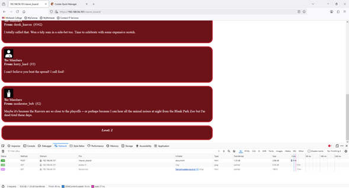

# 🔐 Web Application Security Assessment Lab

## 📌 Overview
This project demonstrates how insecure session management and weak authentication mechanisms in a web application can lead to privilege escalation and account compromise.

The lab simulates a vulnerable web environment where different security levels can be manipulated, allowing an attacker to gain unauthorized access to higher-privileged accounts.

  
   
  <em>Figure 1: Initial access to the vulnerable web application</em>

---

## 🛠️ Lab Environment
- Virtual Machine (Reavers Lab)
- Web application hosted locally
- Firefox browser with Cookie Manager
- Postman for request manipulation

---

## 🎯 Objectives
- Identify security weaknesses in a web application  
- Exploit session and authentication vulnerabilities  
- Perform privilege escalation  
- Simulate brute-force attacks  

---

## 🚨 Vulnerabilities Identified
- Insecure session management  
- Improper access control  
- Weak authentication mechanisms  
- No brute force protection  

---

## ⚔️ Exploitation Techniques

### 🔹 Privilege Escalation via Cookies
User privilege was modified by manipulating cookie values.

  
   
  <em>Figure 2: Privilege escalation achieved through cookie manipulation</em>

### 🔹 Credential Discovery
Application messages revealed valid credentials.

  
   
  <em>Figure 3: Valid credentials identified through application response analysis</em>

### 🔹 Brute Force Attack
Postman was used to automate login attempts and identify valid credentials.

  
   
  <em>Figure 4: Brute force attack simulation using Postman to identify valid credentials</em>

  
   
  <em>Figure 5: Successful privilege escalation resulting in increased access level</em>

---

## 📊 Impact
An attacker could gain unauthorized access to privileged accounts and compromise the system.

---

## 🛡️ Security Recommendations
- Secure session handling  
- Implement MFA  
- Enforce server-side validation  
- Add brute force protection  

---

## 🚀 Skills Demonstrated
- Web security testing  
- Privilege escalation  
- Session manipulation  
- Basic attack simulation  
